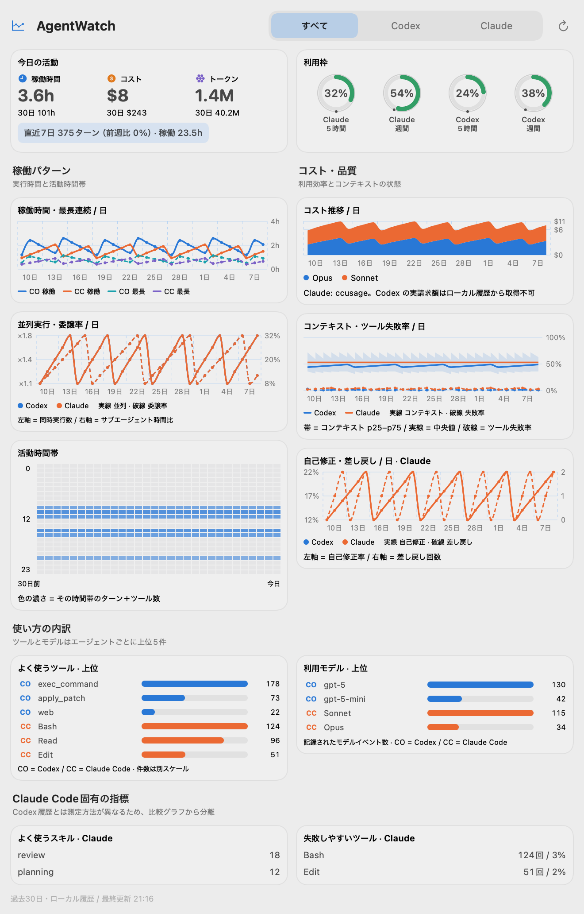

# AgentWatch

macOS メニューバーで Codex と Claude Code の利用状況を並べて見るアプリです。
`すべて / Codex / Claude` の切り替えは、すべてのカードに適用されます。
表示期間は今日を含む過去30日です。

## 画面イメージ



画像の数値は公開用のサンプルデータです。実際の利用履歴や料金は含みません。
`swift build -c release` の後、`.build/release/agentwatch --render-sample docs/dashboard.png`
で再生成できます。

## 指標と出典

| 指標 | Codex | Claude |
| --- | --- | --- |
| セッション・ターン・ツール・トークン・活動時間帯 | `agstats`（なければローカル履歴） | `agstats`（なければローカル履歴と `ccusage`） |
| 稼働時間・最長連続稼働 | `agstats`（なければローカル履歴） | `agstats`（なければ `cchours`） |
| 並列実行・委譲率 | `agstats`（なければローカル履歴） | `agstats`（なければ `cchours`） |
| コンテキスト使用率 p25/p50/p75 | ローカル token count と文脈上限 | `ccsendstats` |
| ツール失敗率 | `agstats`（なければ明示的なエラーフラグ） | `agstats`（なければ `ccflaky`） |
| コスト・$/Mtok | 実請求額は取得不可 | `ccusage` |
| 利用枠 | ローカル履歴中の最新の rate limit 記録 | 保存済み OAuth 認証情報で Anthropic の使用状況 API を照会 |
| 固定トークン・実行中の割り込み率 | 同等の記録なし | `ccsendstats` |
| スキル発火 | 明示的な Skill ツールのみ | `ccskillstats` |
| 自己修正・差し戻し | 同等の構造化記録なし | `ccattention` |

Codex の定額プランの利用を API 料金に換算して「コスト」と呼ぶことはしません。
該当データがないグラフはゼロを描かず、取得不可として示します。Codex と
Claude で測定方法が異なるグラフには、その違いをカード内に記載しています。

[`agstats`](https://github.com/sue738/agstats) と Node.js 22.13 以降が
インストールされている場合、共通指標は agstats の正規化済み履歴を優先します。
GUIアプリから見つけられるよう、`agstats` と `node` は `~/.local/bin`、
`/opt/homebrew/bin`、`/usr/local/bin` のいずれかに配置してください。
初回は従来のローカル集計を先に表示し、agstats の集計が終わると切り替えます。
agstats の結果は15分間キャッシュします。未インストール・読み取り失敗時は従来の
集計を維持します。agstats の稼働時間は60秒超の無記録区間を除外し、並列の
サブエージェント時間を加算します。トークンにもサブエージェント分を含め、
自動実行セッションは除外します。実料金・サービス側の利用枠・コンテキスト指標は
agstats からは取得しません。

Claude の追加指標を使うには `cchours`, `ccusage`, `ccsendstats`,
`ccskillstats`, `ccattention`, `ccflaky` をインストールしてください。欠けている場合も
基本指標は表示されます。追加指標の初回集計には数分かかることがあります。
追加指標は15分間隔、基本指標は5分間隔で更新します。

Codex は `~/.codex/sessions/**/*.jsonl`、Claude は
`~/.claude/projects/**/*.jsonl` を読みます。Claude のサブエージェント履歴は
メインのターン/ツール集計から除外します。スキャン結果は
`~/Library/Application Support/AgentWatch/scan-cache-v5.json` にキャッシュします。
Claude の追加指標も同じ場所に15分間キャッシュします（OAuth 認証情報は含めません）。
Claude の利用枠問い合わせ以外にネットワーク通信はありません。認証情報は
読み取り専用で使用し、キャッシュやログに保存しません。

## ビルドと検証

```sh
swift test
./build.sh
dist/AgentWatch.app/Contents/MacOS/agentwatch --summary
dist/AgentWatch.app/Contents/MacOS/agentwatch --agstats-summary
open dist/AgentWatch.app
```

macOS 14 以降と Xcode Command Line Tools が必要です。ccwatch とは別の
バンドル ID (`com.sue738.agentwatch`) なので、共存できます。

アプリアイコンは独自の棒グラフをコードで描いています。再生成する場合は
`swift make-icon.swift` を実行してください。
